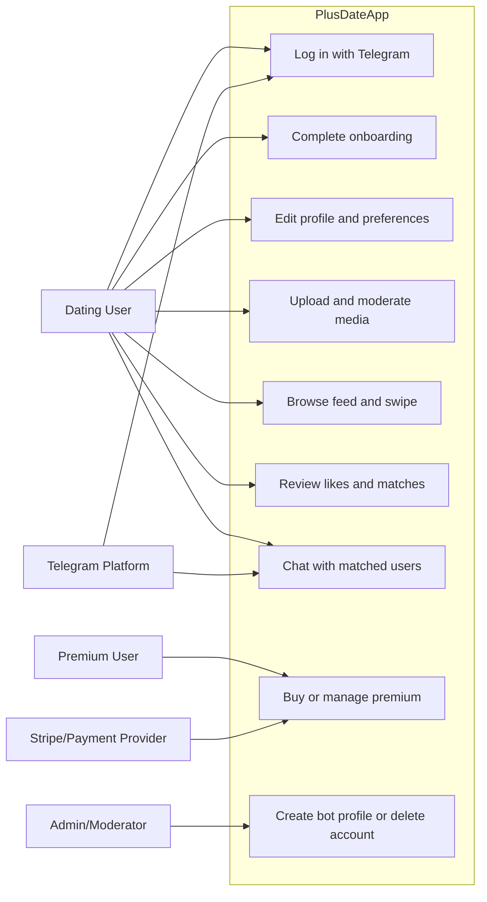

<!-- prev: scope.md | next: ../02-technical/index.md -->

# Features & Requirements

## Epics Overview

| Epic | Description | Stories | Status |
|------|-------------|---------|--------|
| E1: Identity and onboarding | Telegram login, user creation, required profile setup, and moderation entry. | 5 | Completed |
| E2: Profile and preferences | Profile view/edit, media, interests, activity, city, height, age, eye color, and search settings. | 7 | Completed |
| E3: Discovery and matching | Feed profiles, swipe actions, likes, matches, revert action, and limits. | 6 | Completed |
| E4: Communication | Chat list, chat detail, message sending, unread states, and real-time events. | 4 | Completed |
| E5: Safety and monetization | Moderation, storage validation, premium page, subscriptions, and payment callbacks. | 6 | Completed |

## User Stories

### Epic 1: Identity and Onboarding

This epic ensures a user can enter the application through Telegram and complete the minimum profile data required before using the feed.

| ID | User Story | Acceptance Criteria | Priority | Status |
|----|------------|---------------------|----------|--------|
| US-001 | As a Telegram user, I want to log in through Telegram so that I do not create a separate password. | Login endpoint exists; frontend initializes Telegram context; authenticated API calls use Sanctum. | Must | Completed |
| US-002 | As a new user, I want a guided onboarding flow so that I know what data is required. | Routes exist for basic, age, city, interests, media, and verification steps. | Must | Completed |
| US-003 | As a user, I want to upload profile media so that my profile is attractive and trustworthy. | Photo/video upload endpoints and frontend inputs exist; upload rules validate files. | Must | Completed |
| US-004 | As the system, I want to block incomplete or unresolved users from the feed so that the app remains safe. | Router guard redirects non-onboarded users and unresolved moderation cases. | Must | Completed |
| US-005 | As a returning deleted user, I want to restore my account state when possible. | Restore screen exists and backend stores deletion snapshots. | Should | Partially completed |

### Epic 2: Profile and Preferences

This epic lets users describe themselves and control which profiles they want to see.

| ID | User Story | Acceptance Criteria | Priority | Status |
|----|------------|---------------------|----------|--------|
| US-006 | As a user, I want to edit my profile fields so that my data stays current. | Profile edit routes and backend profile upsert endpoint exist. | Must | Completed |
| US-007 | As a user, I want to set city, activity, interests, height, age, and eye color so that matching is more relevant. | Dedicated screens and search preference endpoints exist. | Must | Completed |
| US-008 | As a user, I want to choose a main profile photo so that others see the best media first. | Backend endpoint for main photo selection and media UI exist. | Should | Completed |
| US-009 | As a user, I want to delete my account so that I control my data. | Delete account screen and backend endpoint exist. | Should | Completed |

### Epic 3: Discovery and Matching

The feed is the main dating workflow. It must show relevant profiles and handle user decisions.

| ID | User Story | Acceptance Criteria | Priority | Status |
|----|------------|---------------------|----------|--------|
| US-010 | As a user, I want to browse profile cards so that I can discover people. | Feed page, swipe card stack, and feed profiles endpoint exist. | Must | Completed |
| US-011 | As a user, I want to like or dislike a profile so that the system learns my decision. | Swipe endpoint stores action and returns match result when applicable. | Must | Completed |
| US-012 | As a user, I want matched users to become available for chat. | Match and chat services exist; match events are broadcast. | Must | Completed |
| US-013 | As a premium user, I want to revert an accidental dislike. | Revert dislike UI and backend revert endpoint exist. | Should | Completed |
| US-014 | As a user, I want to see incoming likes. | Likes page and respond-to-like endpoint exist. | Should | Completed |

### Epic 4: Communication

Communication completes the dating loop after a match.

| ID | User Story | Acceptance Criteria | Priority | Status |
|----|------------|---------------------|----------|--------|
| US-015 | As a matched user, I want to open a chat list. | Chats page and user chats endpoint exist. | Must | Completed |
| US-016 | As a matched user, I want to send messages. | Message form, send message endpoint, and message event exist. | Must | Completed |
| US-017 | As a matched user, I want unread states to update. | Unread count query, mark-read endpoint, and read event exist. | Should | Completed |
| US-018 | As a user outside the app, I want Telegram notifications for important chat events. | Notification job and Telegram service exist. | Should | Completed |

### Epic 5: Safety and Monetization

This epic covers operations that make the product more realistic as a business application.

| ID | User Story | Acceptance Criteria | Priority | Status |
|----|------------|---------------------|----------|--------|
| US-019 | As the platform, I want to moderate uploaded photos. | Moderation jobs, validation rules, moderation status, and moderation UI exist. | Must | Completed |
| US-020 | As a user, I want clear feedback when moderation blocks access. | Router guard and moderation screens exist. | Must | Completed |
| US-021 | As a premium user, I want to subscribe. | Premium page, current subscription, subscribe, cancel, Stripe Cashier, and Telegram invoice endpoint exist. | Should | Completed |
| US-022 | As an administrator, I want to create bot/test profiles. | Admin create-bot endpoint exists. | Could | Completed |

## Use Case Diagram

## Non-Functional Requirements

### Performance

| Requirement | Target | Measurement Method |
|-------------|--------|-------------------|
| Initial SPA build | Vite production build succeeds without TypeScript errors. | `npm run build` in `spa`. |
| API response time | Core endpoints should respond within acceptable interactive latency on local Docker setup. | Manual API testing and Laravel logs. |
| Feed pagination | Feed should use cursor pagination and not load all profiles at once. | Backend service uses `cursorPaginate`. |
| Chat pagination | Message history should load in pages. | Backend service uses cursor pagination for chats and messages. |

### Security

- Telegram-based login data is handled by the backend authentication controller.
- API routes are protected with `auth:sanctum` where user identity is required.
- Request classes and rules validate profile, file, feed, chat, and account actions.
- File deletion and profile visibility use rule classes instead of trusting the client.
- Secrets are expected in `.env` files and must not be committed.

### Accessibility

- The application is mobile-first and uses large touch targets for swipe, footer navigation, forms, and media actions.
- Form validation errors are exposed through shared input and error components.
- Further accessibility audit with real devices and screen readers is listed as future work.

### Reliability

| Metric | Target |
|--------|--------|
| Service restart | Containers can be rebuilt from Dockerfiles and compose files. |
| Data persistence | PostgreSQL, Redis, and MinIO use Docker volumes in local setup. |
| Background work | Queues process moderation, notifications, and file-related jobs. |
| Error visibility | Sentry package is included for backend error tracking configuration. |

### Compatibility

| Platform/Browser | Minimum Version |
|------------------|-----------------|
| Telegram mobile webview | Current supported Telegram app versions |
| Chrome | Current stable |
| Safari | Current stable on iOS |
| Android WebView | Current supported Android WebView |
