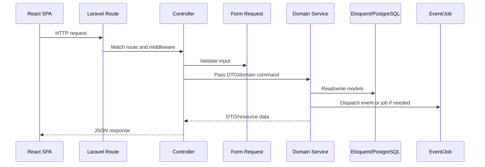

<!-- prev: frontend.md | next: database.md -->

# Criterion: Backend API

## Architecture Decision Record

### Status

**Status:** Accepted

**Date:** May 3, 2026

### Context

The product needs a backend that can handle authenticated user data, profile updates, feed logic, swipe decisions, chat, media files, payments, bot webhooks, dictionaries, moderation, and admin functions. This is more than CRUD: many operations require validation, transactions, background jobs, events, and rule-based access checks.

### Decision

The backend is implemented with Laravel 12 and PHP 8.2. Routes are grouped by domain in `routes/api.php`, controllers delegate business logic to services, request objects validate input, DTOs structure data transfer, Eloquent models persist domain state, and custom rule classes enforce product constraints.

### Alternatives Considered

| Alternative | Pros | Cons | Why Not Chosen |
|-------------|------|------|----------------|
| Node.js/NestJS | TypeScript across stack, modular | More setup for queues/payments/broadcasting/database conventions | Laravel already provides needed backend features |
| Django REST Framework | Mature ORM and admin | Python stack differs from existing repository direction | Less direct fit for Reverb/Cashier ecosystem |
| Fat Laravel controllers | Faster initial coding | Harder to test and maintain | Services and DTOs make flows clearer |

### Consequences

**Positive:**
- Domain routes are easy to inspect.
- Validation is close to HTTP boundaries.
- Services isolate business workflows such as feed, chat, user profile, moderation, storage, and subscriptions.
- Laravel features reduce custom infrastructure code.

**Negative:**
- The service layer must be kept disciplined to avoid duplication.
- API documentation is currently manual instead of generated from OpenAPI annotations.

**Neutral:**
- The API is designed for the SPA, not as a public third-party developer platform.

## Implementation Details

### Project Structure

```text
api/
├── routes/api.php
├── app/Http/Controllers/
├── app/Http/Requests/
├── app/Http/Resources/
├── app/Services/
├── app/Dto/
├── app/Models/
├── app/Rules/
├── app/Events/
└── app/Jobs/
```

### Key Implementation Decisions

| Decision | Rationale |
|----------|-----------|
| Domain route groups | Authentication, user, feed, chat, storage, payment, moderation, admin, and dictionary APIs are separated. |
| Service classes | Business operations are kept out of controllers. |
| DTO and AutoMapper usage | Reduces loose arrays and clarifies request/response transformations. |
| Transactions in services | Chat creation, message sending, and profile upserts protect data consistency. |

### Diagrams



## Requirements Checklist

| # | Requirement | Status | Evidence/Notes |
|---|-------------|--------|----------------|
| 1 | REST API routes | Completed | `api/routes/api.php` defines all main endpoints. |
| 2 | Authentication protection | Completed | Protected group uses `auth:sanctum` and activity middleware. |
| 3 | Validation | Completed | Request classes and rule classes exist by domain. |
| 4 | Business services | Completed | Services exist for user, feed, chat, storage, moderation, dictionary, admin, subscriptions. |
| 5 | Tests | Partially completed | Feature tests exist for feed and profile controllers; more coverage is needed. |
| 6 | Health endpoint | Completed | `/api/healthcheck` returns JSON status. |

## Known Limitations

| Limitation | Impact | Potential Solution |
|------------|--------|-------------------|
| OpenAPI generation is not configured | API docs must be maintained manually | Add OpenAPI annotations or generate docs from routes/resources. |
| Test coverage is incomplete | Some regressions may be missed | Add tests for chat, payments, moderation, and storage. |

## References

- `api/routes/api.php`
- `api/app/Http/Controllers/`
- `api/app/Services/`
- `api/app/Dto/`
- `api/tests/Feature/`
