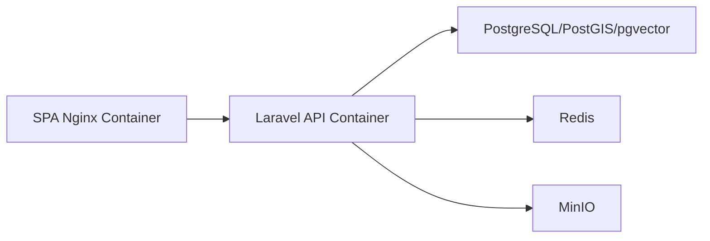

<!-- prev: media-moderation.md | next: ../../03-user-guide/index.md -->

# Criterion: Containerization and Deployment

## Architecture Decision Record

### Status

**Status:** Accepted

**Date:** May 3, 2026

### Context

The application has multiple runtime dependencies: Laravel/PHP, React build tooling, PostgreSQL with extensions, Redis, MinIO, Nginx, and background workers. Manual installation would make review and deployment harder.

### Decision

Provide Dockerfiles and Docker Compose files for the API, SPA, and database layer. The API compose stack includes Laravel, PostgreSQL/PostGIS/pgvector, Redis, and MinIO. The SPA has a Dockerfile and Nginx configuration for serving the production build. The database folder documents extension bootstrap separately.

### Alternatives Considered

| Alternative | Pros | Cons | Why Not Chosen |
|-------------|------|------|----------------|
| Manual local setup only | Simple files | Reviewers must install every service locally | Too fragile for diploma defense |
| Managed platform only | Production-like hosting | Less transparent and may require paid accounts | Local reproducibility is required |
| Kubernetes | Scalable | Excessive complexity for this scope | Docker Compose is enough |

### Consequences

**Positive:**
- Reviewers can reproduce the backend support services.
- Database extensions are explicit.
- Frontend can be served as static files behind Nginx.
- Local object storage is available through MinIO.

**Negative:**
- Environment variables still need correct values.
- Full CI/CD automation is documented but not fully committed as workflow files.

**Neutral:**
- Compose files are appropriate for development and small deployments, not high-availability production.

## Implementation Details

### Project Structure

```text
api/Dockerfile
api/docker-compose.yml
api/nginx.conf
api/docker/
api/docker/database/
spa/Dockerfile
spa/docker-compose.yml
spa/nginx.conf
database/docker-compose.yml
database/Dockerfile
database/init.sql
```

### Key Implementation Decisions

| Decision | Rationale |
|----------|-----------|
| Separate API and SPA containers | Backend runtime and frontend static hosting have different needs. |
| PostGIS image/build | Database must include geospatial support. |
| Redis container | Queues and cache should not depend on local host installation. |
| MinIO container | Local media storage should behave like S3-compatible storage. |

### Diagrams



## Requirements Checklist

| # | Requirement | Status | Evidence/Notes |
|---|-------------|--------|----------------|
| 1 | Backend containerization | Completed | `api/Dockerfile` and `api/docker-compose.yml`. |
| 2 | Frontend containerization | Completed | `spa/Dockerfile`, `spa/docker-compose.yml`, and `spa/nginx.conf`. |
| 3 | Database containerization | Completed | `database/docker-compose.yml`, `database/Dockerfile`, `database/init.sql`. |
| 4 | Supporting services | Completed | Redis and MinIO are in backend compose stack. |
| 5 | Local run documentation | Completed | README files and deployment page describe commands. |
| 6 | CI/CD | Partially completed | Expected pipeline is documented; workflow file is not committed. |

## Known Limitations

| Limitation | Impact | Potential Solution |
|------------|--------|-------------------|
| No committed production CI workflow | Deployment remains manual | Add GitHub Actions or GitLab CI file. |
| Production URLs not specified | Final submission needs updated links | Add production environment details after deployment. |

## References

- `api/docker-compose.yml`
- `spa/docker-compose.yml`
- `database/README.md`
- `thesis-template/docs/02-technical/deployment.md`
