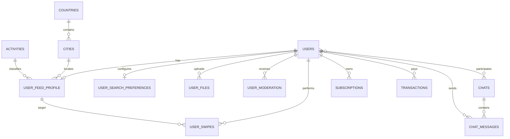

<!-- prev: backend-api.md | next: realtime.md -->

# Criterion: Database Design

## Architecture Decision Record

### Status

**Status:** Accepted

**Date:** May 3, 2026

### Context

A dating application has a connected data model: users, profile fields, media files, moderation records, search preferences, swipes, matches, chats, messages, subscriptions, transactions, dictionaries, and deletion snapshots. The feed also benefits from geospatial filtering and future recommendation support.

### Decision

Use PostgreSQL as the primary relational database and enable PostGIS and pgvector. Laravel migrations define schema evolution. Eloquent models represent domain tables. The database is bootstrapped through Docker and `init.sql`.

### Alternatives Considered

| Alternative | Pros | Cons | Why Not Chosen |
|-------------|------|------|----------------|
| MySQL | Familiar relational database | Weaker fit for PostGIS/pgvector combination | PostgreSQL supports both required extensions |
| MongoDB | Flexible documents | Harder relationships for swipes, chats, subscriptions, and transactions | Product data is relational |
| Separate vector database | Specialized vector search | Additional infrastructure too early | pgvector is enough for diploma scope |

### Consequences

**Positive:**
- Strong relational integrity for dating-domain relationships.
- Geospatial filtering is available inside the main database.
- Vector-ready profile fields can be stored without adding another service.
- Migrations document schema growth over time.

**Negative:**
- PostgreSQL extensions must be present in every environment.
- Some complex filters require careful indexing and query inspection.

**Neutral:**
- The database is optimized for a single backend API, not multi-tenant SaaS isolation.

## Implementation Details

### Main Tables

```text
users
user_feed_profile
user_search_preferences
user_files
user_moderation
user_swipes
chats
chat_users
chat_messages
countries
cities
activities
hobbies
subscriptions
subscription_items
transactions
telegram_subscriptions
user_deletion_snapshots
```

### Key Implementation Decisions

| Decision | Rationale |
|----------|-----------|
| Separate feed profile table | Keeps dating profile/search fields separate from auth identity. |
| `user_swipes` table | Tracks decisions and excludes already-swiped profiles from feed. |
| Chat join table | Supports chat participants and leaves room for extension. |
| Dictionary tables | Countries, cities, activities, and hobbies are seeded and reusable. |
| Deletion snapshot table | Supports account deletion/restore business flow. |

### Diagrams



## Requirements Checklist

| # | Requirement | Status | Evidence/Notes |
|---|-------------|--------|----------------|
| 1 | Relational schema | Completed | Migrations define user, profile, feed, chat, payment, and dictionary tables. |
| 2 | ORM integration | Completed | Eloquent models exist under `api/app/Models`. |
| 3 | Geospatial support | Completed | PostGIS is enabled; feed can order by distance from city coordinates. |
| 4 | Vector support | Completed | pgvector extension and vector field migration exist. |
| 5 | Seed data | Completed | Seeders exist for countries/cities, activities, hobbies, and feed profiles. |
| 6 | Schema documentation | Completed | See [Database Schema](../../appendices/db-schema.md). |

## Known Limitations

| Limitation | Impact | Potential Solution |
|------------|--------|-------------------|
| Index strategy is not fully documented | Performance review needs extra work before production scale | Add indexes for common feed, chat, and moderation queries. |
| Full ERD generated from migrations is not committed | Diagram is maintained manually in docs | Generate schema diagrams from PostgreSQL metadata. |

## References

- `api/database/migrations/`
- `api/database/seeders/`
- `database/init.sql`
- `api/app/Models/`
