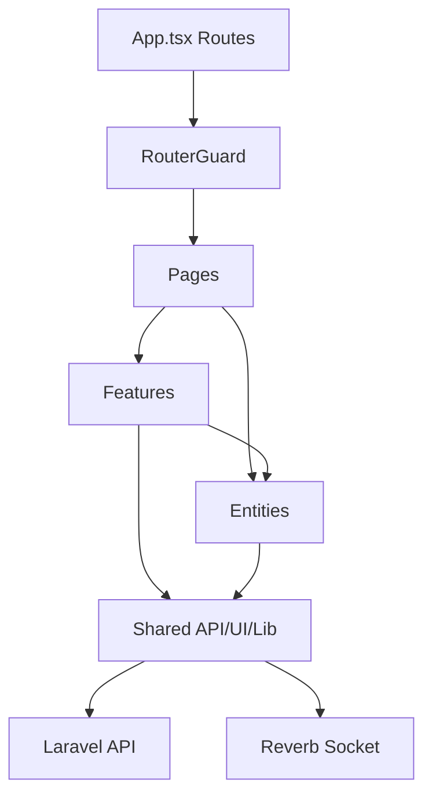

<!-- prev: _template.md | next: backend-api.md -->

# Criterion: Frontend Application

## Architecture Decision Record

### Status

**Status:** Accepted

**Date:** May 3, 2026

### Context

PlusDateApp needs a mobile-first interface that works inside Telegram's webview and supports many stateful flows: onboarding, moderation, feed swiping, profile editing, search preferences, likes, chats, premium screens, account deletion, and restoration. The frontend must feel like a product, not only an API test client, because the dating workflow depends heavily on fast navigation, media previews, touch actions, and clear screen transitions.

### Decision

The frontend is implemented as a React 19 and TypeScript SPA built with Vite. It uses React Router for nested screens, TanStack Query for server state, Zustand for local workflow state, i18next for localization, Framer Motion for transitions, Tailwind CSS for styling, Telegram Mini App SDK for Telegram-specific behavior, and a feature-sliced folder structure.

### Alternatives Considered

| Alternative | Pros | Cons | Why Not Chosen |
|-------------|------|------|----------------|
| Native mobile app | Best device integration | Requires separate iOS/Android builds and app store delivery | Too large for diploma scope and weaker Telegram distribution fit |
| Server-rendered Laravel Blade | Simple deployment with backend | Less suitable for swipe-heavy SPA and Telegram webview state | Product requires interactive mobile UI |
| Next.js | Strong routing and SSR | Extra SSR complexity not needed for Telegram Mini App | Vite SPA is simpler and sufficient |

### Consequences

**Positive:**
- Clear route tree for all product screens.
- Strong typing for UI models and API responses.
- Fast local development and production builds.
- Frontend code is organized by app, pages, widgets, features, entities, and shared modules.

**Negative:**
- SPA behavior depends on correct API and Telegram initialization.
- More client-side state must be managed carefully.

**Neutral:**
- SEO is not a major target because the primary channel is Telegram Mini App usage.

## Implementation Details

### Project Structure

```text
spa/src/
├── app/          # bootstrap, providers, routes, styles, config
├── pages/        # full user screens
├── processes/    # onboarding and moderation processes
├── widgets/      # page layout, action menu, camera modal, payment modals
├── features/     # swipe cards and user interactions
├── entities/     # user, chats, likes, dictionary, profile components
└── shared/       # API client, sockets, UI kit, hooks, assets, types
```

### Key Implementation Decisions

| Decision | Rationale |
|----------|-----------|
| Feature-sliced structure | Keeps a large SPA navigable and separates domain entities from pages. |
| RouterGuard | Centralizes onboarding, deleted account, moderation, and footer visibility rules. |
| TanStack Query | Avoids manual loading/error/cache code for API-heavy screens. |
| Shared UI kit | Keeps buttons, inputs, selectors, media carousel, tabs, and modals consistent. |

### Diagrams



## Requirements Checklist

| # | Requirement | Status | Evidence/Notes |
|---|-------------|--------|----------------|
| 1 | SPA with multiple screens | Completed | `spa/src/app/App.tsx` defines onboarding, moderation, feed, profile, likes, premium, chats, and guest routes. |
| 2 | Typed frontend | Completed | TypeScript project with entity and API types. |
| 3 | API integration | Completed | Shared Axios instance and query modules under `entities` and `features`. |
| 4 | State management | Completed | TanStack Query and Zustand are used. |
| 5 | Mobile/Telegram behavior | Completed | Telegram initialization and back button/safe area behavior exist. |
| 6 | Build and lint scripts | Completed | `npm run build` and `npm run lint` are defined. |

## Known Limitations

| Limitation | Impact | Potential Solution |
|------------|--------|-------------------|
| No formal E2E suite in repository | UI regressions require manual checks | Add Playwright tests for onboarding, feed, and chat. |
| Accessibility audit not documented | Some mobile UI details may need improvement | Run keyboard/screen-reader checks and fix shared components. |

## References

- `spa/src/app/App.tsx`
- `spa/src/app/router/ui/RouterGuard.tsx`
- `spa/src/shared/ui/`
- `spa/package.json`
