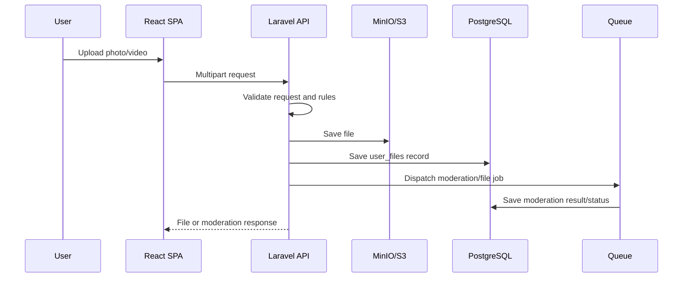

<!-- prev: telegram-auth.md | next: containerization-deployment.md -->

# Criterion: Media Storage and Moderation

## Architecture Decision Record

### Status

**Status:** Accepted

**Date:** May 3, 2026

### Context

Dating applications rely on user photos and videos, but unsafe or invalid media can damage trust. The system needs upload validation, profile file records, moderation state, derived media processing, and frontend flows that prevent unresolved moderation problems from being ignored.

### Decision

Implement media workflows through Laravel storage services, file upload request validation, file-specific rule classes, user file models, moderation records, moderation jobs, and dedicated frontend media/moderation screens. Local development uses MinIO, while the backend includes S3/GCS-compatible storage dependencies.

### Alternatives Considered

| Alternative | Pros | Cons | Why Not Chosen |
|-------------|------|------|----------------|
| Store files in database | Simple backup story | Poor performance and large database size | Object storage is better for media |
| Only client-side validation | Fast feedback | Not secure or trustworthy | Backend validation is required |
| Manual moderation only | Human judgment | Slow and incomplete for diploma scope | Automated jobs and moderation states are more practical |

### Consequences

**Positive:**
- Upload and deletion are centralized.
- Moderation status can control user routing.
- Background jobs can process derived assets such as blurred photos.
- Storage provider can change without rewriting controllers.

**Negative:**
- Media workflows require object storage configuration.
- Moderation decisions need careful UX so users understand blocked states.

**Neutral:**
- Full human moderation tooling is outside current scope.

## Implementation Details

### Project Structure

```text
api/app/Http/Controllers/Storage/FileController.php
api/app/Http/Controllers/Moderation/ModerationController.php
api/app/Http/Requests/Storage/
api/app/Rules/Storage/
api/app/Rules/UserProfile/
api/app/Services/User/FileService.php
api/app/Services/Storage/StorageService.php
api/app/Services/Moderation/ModerationService.php
api/app/Jobs/File/CreateBlurredPhotoJob.php
api/app/Jobs/Moderation/
spa/src/processes/moderation/
spa/src/shared/ui/FileInput/
spa/src/widgets/CameraModal/
```

### Key Implementation Decisions

| Decision | Rationale |
|----------|-----------|
| Store metadata in `user_files` | Database tracks ownership, type, moderation, and main-photo state. |
| Use object storage | Scales better than filesystem/database media storage. |
| Moderate through jobs and records | Separates upload from moderation workflow and user routing. |
| Frontend route guard for moderation | Users with unresolved moderation cases are redirected before feed usage. |

### Diagrams



## Requirements Checklist

| # | Requirement | Status | Evidence/Notes |
|---|-------------|--------|----------------|
| 1 | Photo upload | Completed | Storage and user profile routes include photo upload/update. |
| 2 | Video upload | Completed | User and storage endpoints include video upload/delete. |
| 3 | Backend validation | Completed | Storage and user profile request/rule classes exist. |
| 4 | Moderation model | Completed | `UserModeration` model and migrations exist. |
| 5 | Background processing | Completed | Moderation and blurred photo jobs exist. |
| 6 | Frontend moderation UX | Completed | Moderation process and route guard exist. |

## Known Limitations

| Limitation | Impact | Potential Solution |
|------------|--------|-------------------|
| Full moderator dashboard is missing | Manual review workflow is limited | Add admin moderation queue UI. |
| Media CDN strategy is not documented | Production media delivery may be slower | Add CDN/storage bucket configuration. |

## References

- `api/app/Services/Storage/StorageService.php`
- `api/app/Services/User/FileService.php`
- `api/app/Services/Moderation/ModerationService.php`
- `api/app/Jobs/Moderation/`
- `spa/src/processes/moderation/`
