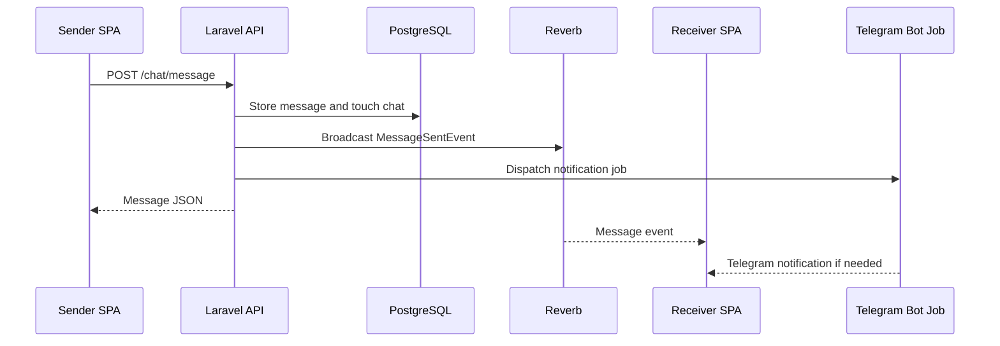

<!-- prev: database.md | next: telegram-auth.md -->

# Criterion: Real-Time Communication

## Architecture Decision Record

### Status

**Status:** Accepted

**Date:** May 3, 2026

### Context

Dating chat and match feedback lose value when updates appear only after manual refresh. The application needs real-time signals for message sending, read states, chat creation, likes, matches, match deletion, and moderation/user updates.

### Decision

Use Laravel events with broadcasting and Laravel Reverb for private channels. The frontend uses Laravel Echo-related dependencies and socket hooks to receive message and read events. Queue jobs and events keep user-facing updates separated from synchronous HTTP responses.

### Alternatives Considered

| Alternative | Pros | Cons | Why Not Chosen |
|-------------|------|------|----------------|
| Polling | Simple and reliable | Slow, wasteful, poor chat UX | Chat needs immediate updates |
| Third-party realtime provider | Managed infrastructure | Extra cost and vendor dependency | Laravel Reverb is already in stack |
| Custom WebSocket server | Full control | More code and auth complexity | Reverb integrates with Laravel channels |

### Consequences

**Positive:**
- Chat messages and read states can update without page refresh.
- Private channels use Laravel authentication boundaries.
- Events are explicit domain objects.

**Negative:**
- Deployment must expose and configure socket host, port, and auth URL.
- Local debugging requires both API and socket services.

**Neutral:**
- Some notifications are also sent through Telegram bot jobs, which complements in-app realtime.

## Implementation Details

### Project Structure

```text
api/app/Events/Chat/
api/app/Events/Feed/
api/app/Events/Moderation/
api/routes/channels.php
api/app/Broadcasting/
spa/src/shared/sockets/
spa/src/pages/chat/lib/
```

### Key Implementation Decisions

| Decision | Rationale |
|----------|-----------|
| Domain-specific events | `MessageSentEvent`, `MessageReadEvent`, `MatchEvent`, and moderation events are easy to trace. |
| Private channel authorization | Chat and user updates must not be public. |
| Socket hooks in frontend | Keeps subscription logic reusable in chat pages and shared modules. |

### Diagrams



## Requirements Checklist

| # | Requirement | Status | Evidence/Notes |
|---|-------------|--------|----------------|
| 1 | Real-time events | Completed | Chat, feed, and moderation events exist under `api/app/Events`. |
| 2 | Private channels | Completed | Broadcasting channel classes and `routes/channels.php` exist. |
| 3 | Frontend subscriptions | Completed | Socket utilities and chat hooks exist in SPA. |
| 4 | Message read state | Completed | `markMessageRead` endpoint and `MessageReadEvent` exist. |
| 5 | Async notifications | Completed | Telegram notification jobs are dispatched for message events. |

## Known Limitations

| Limitation | Impact | Potential Solution |
|------------|--------|-------------------|
| Reconnect behavior needs production testing | Mobile network changes may interrupt sockets | Add explicit retry/backoff and UX indicators. |
| Load testing is not documented | Reverb capacity is unknown | Run socket load tests before production launch. |

## References

- `api/app/Events/Chat/`
- `api/app/Events/Feed/`
- `api/app/Broadcasting/`
- `spa/src/shared/sockets/`
- `spa/src/pages/chat/lib/useChatSocket.ts`
