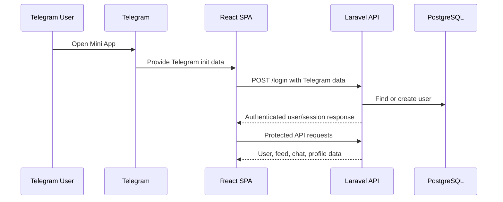

<!-- prev: realtime.md | next: media-moderation.md -->

# Criterion: Authentication and Telegram Integration

## Architecture Decision Record

### Status

**Status:** Accepted

**Date:** May 3, 2026

### Context

The product is designed as a Telegram Mini App, so authentication should not imitate a separate email/password product. It should use Telegram as the user entry channel, support bot webhooks and notifications, and still protect backend routes with normal API authentication.

### Decision

Use a Telegram login endpoint on the backend, Laravel Sanctum for authenticated API routes, Telegram bot webhook endpoints for user and moderation actions, and frontend Telegram SDK initialization for webview behavior.

### Alternatives Considered

| Alternative | Pros | Cons | Why Not Chosen |
|-------------|------|------|----------------|
| Email/password login | Familiar | Adds registration friction and password handling | Telegram Mini App should use Telegram identity |
| OAuth provider login | Standard identity flow | Less integrated with Telegram bot and invoices | Telegram is the target platform |
| Anonymous sessions only | Fast initial access | Unsafe for dating, chat, media, and payments | User identity is required |

### Consequences

**Positive:**
- Users start from a familiar Telegram context.
- Bot notifications and invoices fit the same ecosystem.
- Backend routes remain protected by Sanctum.

**Negative:**
- Local testing requires Telegram test data or mocks.
- Production correctness depends on securely validating Telegram login data and secrets.

**Neutral:**
- The app is intentionally coupled to Telegram as a platform choice.

## Implementation Details

### Project Structure

```text
api/app/Http/Controllers/Auth/TelegramController.php
api/app/Http/Controllers/Bot/TelegramBotController.php
api/app/Services/TelegramService.php
api/config/telegram.php
api/routes/api.php
spa/src/app/init.ts
spa/src/app/providers/AuthProvider.tsx
```

### Key Implementation Decisions

| Decision | Rationale |
|----------|-----------|
| Public `/login` route | Telegram auth must be available before Sanctum-protected calls. |
| Protected route group | All user data and actions require authenticated identity. |
| Telegram bot webhooks | Bot and moderation events can enter the backend separately from SPA HTTP requests. |
| Frontend initialization | Telegram viewport, safe area, theme, closing behavior, location, and swipe behavior are configured in the SPA. |

### Diagrams



## Requirements Checklist

| # | Requirement | Status | Evidence/Notes |
|---|-------------|--------|----------------|
| 1 | Platform authentication | Completed | `POST /login` handled by Telegram controller. |
| 2 | Protected API routes | Completed | Route group uses `auth:sanctum`. |
| 3 | Telegram webhooks | Completed | Bot and moderation webhook routes exist. |
| 4 | Frontend Telegram SDK usage | Completed | Initialization is documented in SPA README and implemented in `src/app/init.ts`. |
| 5 | Bot notifications | Completed | Telegram service and notification jobs exist. |

## Known Limitations

| Limitation | Impact | Potential Solution |
|------------|--------|-------------------|
| Authentication test fixtures are not documented | Reviewers need manual Telegram setup details | Add mock login mode or documented test init data. |
| Platform coupling | Non-Telegram users cannot use full flow directly | Add optional email/social login only if product expands. |

## References

- `api/app/Http/Controllers/Auth/TelegramController.php`
- `api/app/Http/Controllers/Bot/TelegramBotController.php`
- `api/app/Services/TelegramService.php`
- `spa/src/app/init.ts`
