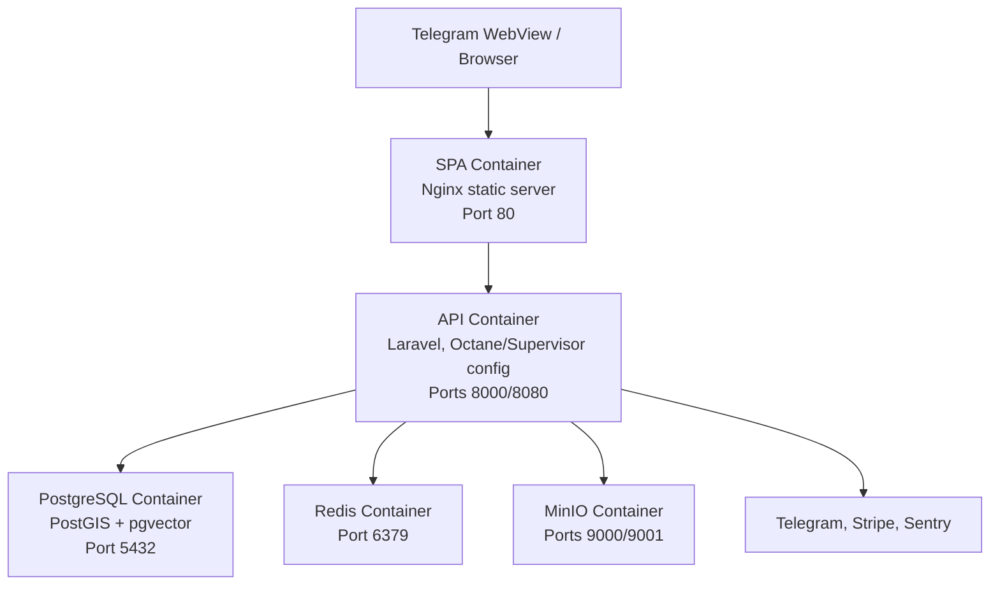
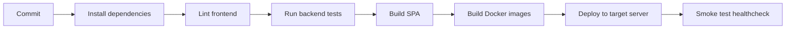

<!-- prev: tech-stack.md | next: criteria/_template.md -->

# Deployment & DevOps

## Infrastructure

### Deployment Architecture



The repository contains separate Docker assets for the API, SPA, and database bootstrap. The backend compose stack starts Laravel, PostgreSQL/PostGIS, Redis, and MinIO. The SPA compose stack builds the Vite application and serves the generated static files with Nginx.

### Environments

| Environment | URL | Branch |
|-------------|-----|--------|
| **Development API** | `http://localhost:8000` | local feature branch |
| **Development SPA** | `http://localhost:5173` for Vite or `http://localhost` for Nginx container | local feature branch |
| **Development database** | `localhost:5432` | local Docker volume |
| **Production** | [https://t.me/stage_plusdate_bot](https://t.me/stage_plusdate_bot) | main/release branch |

## CI/CD Pipeline

### Pipeline Overview



The repository does not include a finished hosted CI configuration. The documented pipeline below is the expected production pipeline based on the available scripts and Docker files.

### Pipeline Steps

| Step | Tool | Actions |
|------|------|---------|
| **Install** | Composer, npm | Install backend and frontend dependencies. |
| **Lint** | ESLint | Run `npm run lint` in `spa`. |
| **Test** | PHPUnit/Laravel | Run `php artisan test` or `composer test` in `api`. |
| **Build SPA** | TypeScript, Vite | Run `npm run build` in `spa`. |
| **Build containers** | Docker | Build API, SPA, and database images where needed. |
| **Deploy** | Target hosting platform | Push images or run compose stack with environment variables. |
| **Verify** | HTTP smoke checks | Call `/api/healthcheck`, open SPA, and test authentication-dependent flows. |

### Example Pipeline Configuration

```yaml
name: plusdate-ci

on:
  push:
    branches: [main]
  pull_request:
    branches: [main]

jobs:
  verify:
    runs-on: ubuntu-latest
    steps:
      - uses: actions/checkout@v4
      - uses: actions/setup-node@v4
        with:
          node-version: 22
      - name: Install SPA dependencies
        working-directory: spa
        run: npm ci
      - name: Lint SPA
        working-directory: spa
        run: npm run lint
      - name: Build SPA
        working-directory: spa
        run: npm run build
      - name: Build backend image
        working-directory: api
        run: docker compose build
```

## Environment Variables

| Variable | Description | Required | Example |
|----------|-------------|----------|---------|
| `APP_NAME` | Laravel application name | Yes | `PlusDate` |
| `APP_URL` | Public API URL | Yes | `https://api.example.com` |
| `DB_CONNECTION` | Database driver | Yes | `pgsql` |
| `DB_HOST` | Database host | Yes | `postgres` |
| `DB_DATABASE` | Database name | Yes | `plusdate` |
| `DB_USERNAME` | Database username | Yes | `plusdate` |
| `DB_PASSWORD` | Database password | Yes | Stored as secret |
| `REDIS_HOST` | Redis host | Yes | `redis` |
| `MINIO_ROOT_USER` | Local object storage username | Local | Stored as secret |
| `MINIO_ROOT_PASSWORD` | Local object storage password | Local | Stored as secret |
| `VITE_API_URL` | SPA API base URL | Yes | `https://api.example.com/api` |
| `VITE_SOCKET_AUTH_URL` | WebSocket auth endpoint | Yes | `https://api.example.com/broadcasting/auth` |
| `VITE_SOCKET_HOST` | WebSocket host | Yes | `api.example.com` |
| `VITE_SOCKET_PORT` | WebSocket port | Yes | `443` |
| `VITE_GTM_TOKEN` | Google Tag Manager token | Optional | Stored as secret |

**Secrets Management:** Local development uses `.env` files. Production deployment should use hosting platform secrets or CI/CD secrets. Real Telegram, Stripe, storage, database, and Sentry credentials must not be committed.

## How to Run Locally

### Prerequisites

- Node.js 22+
- PHP 8.2+
- Composer
- Docker and Docker Compose
- PostgreSQL client tools are optional but useful for inspection

### Backend Setup

```bash
cd api
cp .env.example .env
composer install
npm install
php artisan key:generate
docker compose up -d --build
php artisan migrate --seed
php artisan queue:listen --tries=1
```

Useful checks:

```bash
php artisan test
php artisan route:list
curl http://localhost:8000/api/healthcheck
```

### Frontend Setup

```bash
cd spa
cp .env.example .env
npm install
npm run dev
```

For a production-style local frontend container:

```bash
cd spa
docker compose up -d --build
```

### Database Setup

```bash
cd database
docker compose up -d --build
```

The database bootstrap enables `postgis`, `postgis_topology`, and `vector` extensions.

## Monitoring & Logging

| Aspect | Tool | Notes |
|--------|------|-------|
| **Application logs** | Laravel logs / Laravel Pail | Local development and debugging. |
| **Error tracking** | Sentry Laravel package | Dependency is included; production DSN should be configured through environment variables. |
| **Queue visibility** | Laravel queue logs | Queue workers process moderation, notification, and file jobs. |
| **Health check** | `/api/healthcheck` | Returns JSON status for smoke tests. |
