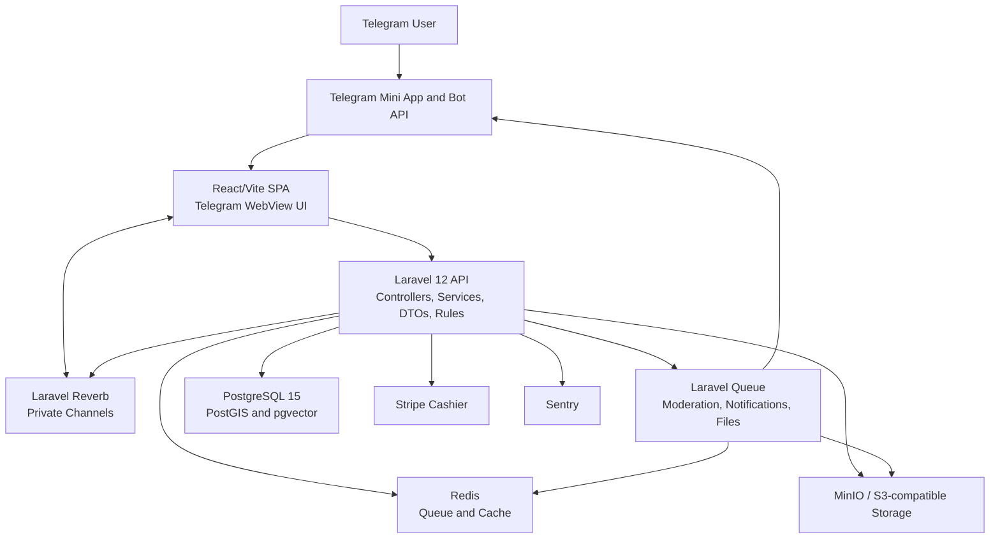
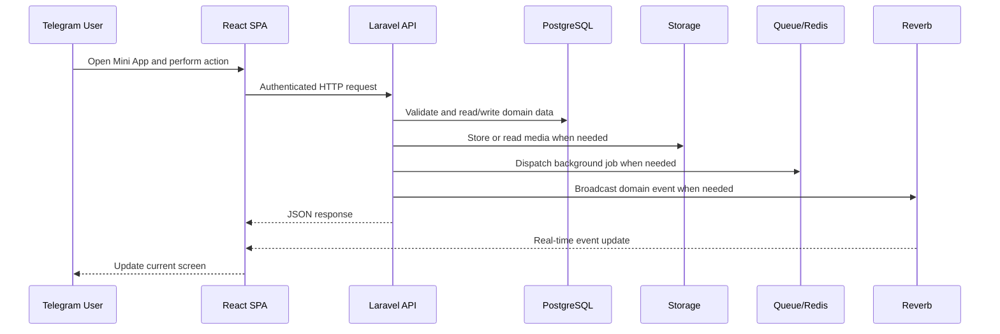

<!-- prev: ../01-project-overview/features.md | next: tech-stack.md -->

# 2. Technical Implementation

This section describes the architecture, technology choices, implementation decisions, selected assessment criteria, and deployment approach for PlusDateApp.

## Contents

- [Tech Stack](tech-stack.md)
- [Criteria Documentation](criteria/_template.md)
- [Deployment](deployment.md)

## Solution Architecture

### High-Level Architecture

The frontend is a single page application designed for Telegram's mobile webview. It communicates with the Laravel API over HTTP and subscribes to private real-time channels through Laravel Echo/Reverb. The backend owns domain logic for profiles, feed, swipes, chats, moderation, files, subscriptions, dictionaries, and administration. PostgreSQL stores structured data, PostGIS supports distance-based city filtering, pgvector prepares the profile table for vector features, Redis supports queues/cache, and MinIO or S3-compatible storage stores uploaded media.

### System Components

| Component | Description | Technology |
|-----------|-------------|------------|
| **Frontend SPA** | Mobile-first Telegram Mini App UI with onboarding, profile, feed, likes, chat, premium, moderation, and settings screens. | React 19, TypeScript, Vite 7, React Router, TanStack Query, Zustand, i18next, Tailwind CSS 4 |
| **Backend API** | REST API and business workflows for authentication, users, feed, chat, storage, moderation, payments, dictionaries, admin, and bot webhooks. | Laravel 12, PHP 8.2, Sanctum, DTOs, services, rules, Eloquent |
| **Database** | Persistent relational data with geospatial and vector extensions. | PostgreSQL 15, PostGIS, pgvector |
| **Realtime** | Private event channels for chat, matches, moderation, and user updates. | Laravel Reverb, Laravel Echo |
| **Queue and Cache** | Background jobs for moderation, media processing, notifications, and system tasks. | Redis, Laravel Queue |
| **Storage** | User photo/video storage and derived blurred images. | MinIO locally, S3/GCS-compatible abstractions |
| **External Services** | Identity, notifications, invoices, payments, error tracking. | Telegram Bot API, Stripe Cashier, Sentry |

### Data Flow

## Key Technical Decisions

| Decision | Rationale | Alternatives Considered |
|----------|-----------|------------------------|
| Use Telegram Mini App instead of native apps | Fast access, Telegram identity, bot notifications, and no app-store delivery requirement. | Native iOS/Android, generic responsive website |
| Use Laravel as backend | Strong API, queues, events, validation, Eloquent ORM, Sanctum, Cashier, and Reverb support. | Node.js/NestJS, Django, Spring Boot |
| Use React/Vite SPA | Fast iteration, TypeScript support, rich mobile UI, feature-sliced frontend structure. | Vue, Next.js, server-rendered Blade |
| Use PostgreSQL with PostGIS and pgvector | One database supports relational data, distance ordering, and vector-ready profile features. | MySQL, MongoDB, separate vector DB |
| Use service and DTO layers | Keeps controllers thin and makes business flows explicit. | Fat controllers, direct model manipulation from frontend-specific controllers |
| Use Docker assets | Reproducible local setup for API, database, Redis, MinIO, and SPA. | Manual local installation only |

## Security Overview

| Aspect | Implementation |
|--------|----------------|
| **Authentication** | Telegram login endpoint and Laravel Sanctum protected routes. |
| **Authorization** | Route middleware, request validation, and domain rule classes such as file, profile, feed, and storage rules. |
| **Data Protection** | HTTPS is expected in production; secrets are environment variables; uploaded files are handled by storage services. |
| **Input Validation** | Laravel form requests, enum-based validation, zod schemas in frontend forms, and custom rule classes. |
| **Secrets Management** | `.env` files for local development; deployment should use platform secrets. |
| **Moderation** | User moderation records, moderation jobs, and frontend route guards block unresolved high-risk states. |
