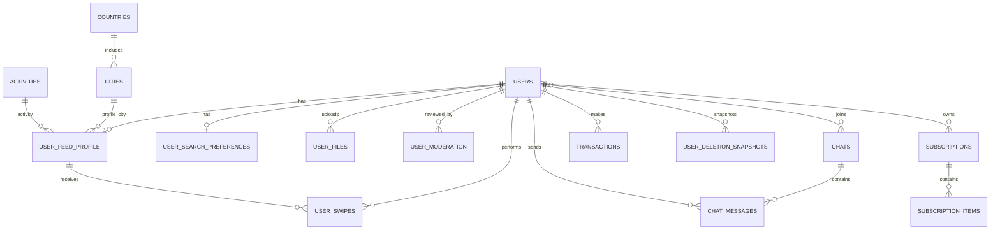

<!-- prev: api-reference.md | next: none -->

# Database Schema

## Overview

| Attribute | Value |
|-----------|-------|
| **Database** | PostgreSQL with PostGIS and pgvector |
| **Version** | PostgreSQL 15 image in Docker setup |
| **ORM** | Laravel Eloquent |
| **Schema Management** | Laravel migrations |

## Entity Relationship Diagram



## Tables

### users

Stores the authenticated user identity and account-level flags.

| Column Group | Description |
|--------------|-------------|
| Identity | Telegram/user identity, name-related fields, contact/payment customer fields. |
| State flags | Onboarded, premium, under moderation, soft delete fields. |
| Timestamps | Standard creation/update/delete timestamps. |

### user_feed_profile

Stores public dating profile and feed-searchable fields.

| Column Group | Description |
|--------------|-------------|
| Profile basics | Age, sex, height, activity, city, interests/hobbies, eye color, search purpose. |
| Location/vector | Coordinates and vector-ready field for advanced discovery. |
| Ownership | Linked to `users`. |

### user_search_preferences

Stores the user's desired feed filters.

| Column Group | Description |
|--------------|-------------|
| Demographics | Gender, age range, height range, eye color. |
| Discovery filters | City, activity, hobbies, premium/video flags, search purpose. |
| Ownership | Linked to `users`. |

### user_files

Stores metadata for uploaded profile media.

| Column Group | Description |
|--------------|-------------|
| File metadata | Type, path/provider metadata, moderation state, main-photo flag. |
| Ownership | Linked to `users`. |
| Processing | Used by media jobs such as blurred photo creation. |

### user_moderation

Stores moderation records and rejection/resolution state for user media/profile issues.

| Column Group | Description |
|--------------|-------------|
| Moderation result | Rejection reason, resolution flag, related file/profile data. |
| Ownership | Linked to `users`. |

### user_swipes

Stores user decisions in the feed.

| Column Group | Description |
|--------------|-------------|
| Decision | Swipe action and match-related state. |
| Relationships | Links swiping user and target `user_feed_profile`. |

### chats, chat_users, chat_messages

Stores one-to-one conversations, participants, messages, unread/read state, and timestamps.

| Table | Purpose |
|-------|---------|
| `chats` | Conversation container. |
| `chat_users` | Participants and join metadata. |
| `chat_messages` | Message content, sender, sent time, and read time. |

### dictionaries

Stores reusable reference values.

| Table | Purpose |
|-------|---------|
| `countries` | Country names and metadata. |
| `cities` | City names, country relation, and location data. |
| `activities` | User activity/profession categories with optional emoji. |
| `hobbies` | Interest/hobby reference data. |

### subscriptions and transactions

Stores premium and payment data.

| Table | Purpose |
|-------|---------|
| `subscriptions` | Laravel Cashier subscription records. |
| `subscription_items` | Subscription item records. |
| `transactions` | Payment transaction data. |
| `telegram_subscriptions` | Telegram-specific subscription or invoice state. |

### account lifecycle tables

| Table | Purpose |
|-------|---------|
| `user_deletion_snapshots` | Account deletion restore-related data. |
| `user_bot_notifications` | Bot notification state. |
| `reflinks` | Referral link-related data. |
| `start_log` | Bot/start tracking data. |
| `personal_access_tokens` | Sanctum token storage. |
| `failed_jobs` | Laravel failed queue job records. |

## Relationships

| Relationship | Type | Description |
|--------------|------|-------------|
| `users` to `user_feed_profile` | One-to-One | A user has one public feed profile. |
| `users` to `user_search_preferences` | One-to-One | A user has one preference set for feed filtering. |
| `users` to `user_files` | One-to-Many | A user uploads multiple media files. |
| `users` to `user_swipes` | One-to-Many | A user performs multiple feed decisions. |
| `user_feed_profile` to `user_swipes` | One-to-Many | A profile can receive many swipe decisions. |
| `users` to `chats` | Many-to-Many | Users participate in chats through `chat_users`. |
| `chats` to `chat_messages` | One-to-Many | A chat contains many messages. |
| `countries` to `cities` | One-to-Many | A country contains many cities. |
| `cities` to `user_feed_profile` | One-to-Many | Many profiles can be located in one city. |
| `users` to `subscriptions` | One-to-Many | A user may have subscription records. |

## Migrations

| Area | Example Migration Files |
|------|-------------------------|
| Users/Auth | `0001_01_01_000000_create_users_table.php`, `2025_07_21_183612_create_personal_access_tokens_table.php` |
| Dictionaries | `2025_07_24_150607_create_countries_table.php`, `2025_07_24_150617_create_cities_table_table.php`, `2025_07_25_140759_create_activities_table.php`, `2025_07_28_183037_create_hobbies_table.php` |
| Profiles | `2025_07_24_185455_create_user_feed_profile_table.php`, `2025_08_17_115520_creat_user_search_preferences_table.php` |
| Media/Moderation | `2025_08_08_144311_create_user_files_table.php`, `2025_08_13_135638_create_user_moderation_table.php` |
| Feed/Chat | `2025_09_02_182822_create_user_swipes_table.php`, `2025_08_24_122303_create_chats_table.php`, `2025_08_24_122401_create_chat_users_table.php`, `2025_08_24_122405_create_chat_messages_table.php` |
| Payments | `2025_09_10_150750_create_customer_columns.php`, `2025_09_10_150751_create_subscriptions_table.php`, `2025_09_10_150752_create_subscription_items_table.php`, `2025_11_27_083518_create_transactions_table.php` |
| Account lifecycle | `2025_12_16_115154_create_user_deletion_snapshots_table.php` |

## Seeding

Seeders are available for core dictionary and test data:

```bash
cd api
php artisan migrate --seed
```

Important seeders include:

- `CountriesAndCitiesSeeder`
- `ActivitySeeder`
- `HobbiesSeeder`
- `UserFeedProfileSeeder`
- `DatabaseSeeder`
